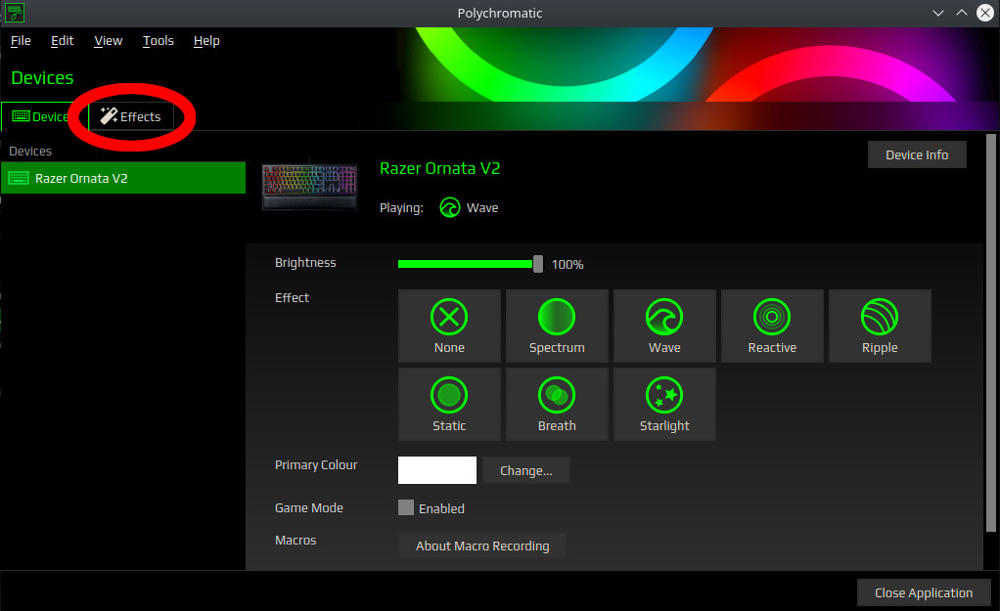
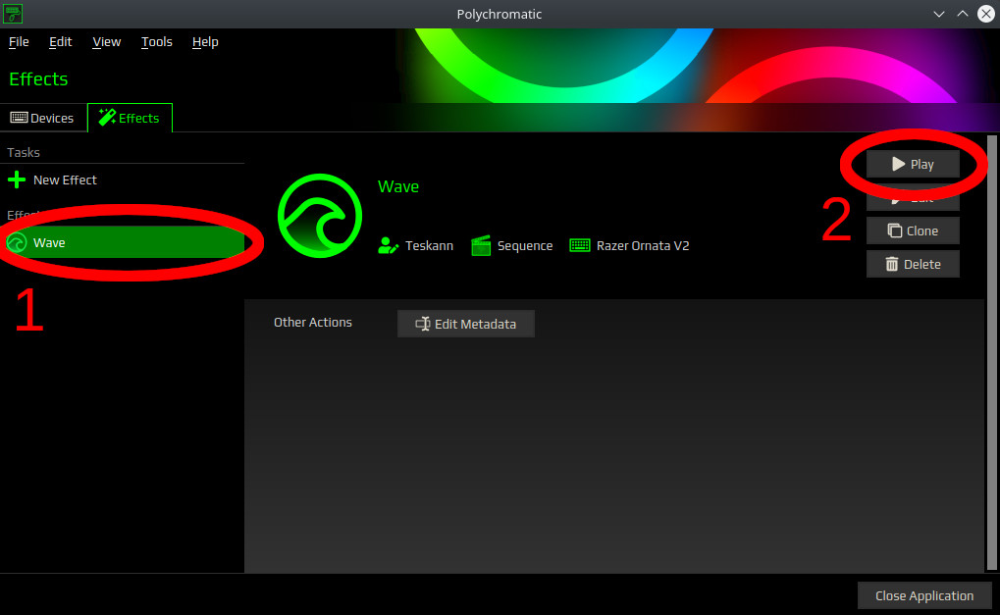

# Razer Waver :ocean:

Generate a customizable RGB wave effect for your Razer keyboard on Linux ! 🌈

## Table of Contents

- [Why Razer Waver ?](#why-razer-waver-)
- [How to use it ?](#how-to-use-it-)
    - [Prerequisites](#prerequisites)
    - [Get Razer Waver](#get-razer-waver)
    - [Create the wave effect](#create-the-wave-effect)
    - [Apply the wave effect](#apply-the-wave-effect)
- [Customize](#customize)
  - [Examples](#examples)
- [Technical details](#technical-details)
- [Compatibility](#compatibility)

## Why Razer Waver ?

[OpenRazer](https://openrazer.github.io/) does not provide a duration parameter for the wave effect on keyboards.
The default speed is kind of high on multiple devices and it would be cool to
slow it down a bit.
([read more](https://github.com/polychromatic/polychromatic/issues/219#issuecomment-554792903)).
[Polychromatic](https://github.com/polychromatic/polychromatic) provides an
effect editor where you can create your own animations
for your keyboard, including a wave. However, this can be long to setup by
hand. Use Razer Waver to create it in a second !

## How to use it ?

### Prerequisites

- Install Python 3.6+
- Install [OpenRazer](https://openrazer.github.io/) (required for polychromatic).
- Install [polychromatic](https://github.com/polychromatic/polychromatic) to configure your keyboard.

*You will probably need to launch Polychromatic once before going to the next step.*

### Get Razer Waver

```
git clone https://github.com/Teskann/razer-waver
cd razer-waver
```

### Create the wave effect

```
python create-wave.py  # This creates the default wave effect. Click below to customize it
```

[I want to customize the wave !](#customize)

### Apply the wave effect

Run polychromatic and click on the *Effects* tab.



There you should see a new *Wave* effect. Click on it and click on *Play* !



## Customize

You can customize your wave using the following parameters :
```
usage: create-wave.py [-h] [-d DURATION] [-D DIRECTION] [--fps FPS]
                      [-c COLUMNS] [-r ROWS] [--device DEVICE] [-o OUTPUT]

Generate an RGB wave effect for polychromatic.

optional arguments:
  -h, --help            show this help message and exit
  -d DURATION, --duration DURATION
                        Wave period in seconds. Default is 5.
  -D DIRECTION, --direction DIRECTION
                        Wave direction. `LR` for left to right, `RL` for right
                        to left. Default is `LR`
  --fps FPS             Frames per seconds of the wave. Defaults to 24.
  -c COLUMNS, --columns COLUMNS
                        Number of columns in the keyboard. Default is 22.
  -r ROWS, --rows ROWS  Number of rowq in the keyboard. Default is 6.
  --device DEVICE       Name of the Razer device. Defaults to `Razer Ornata
                        V2`. Please, enter the real name of the device, as it
                        shows up in Polychromatic. You will probably need to
                        fix the number of rows and columns so they fit your
                        device, using `-r` and `-c` parameters. To know how
                        many columns and rows your device has, you can create
                        a dummy Polychromatic effect and check how many
                        rows/columns appear in the matrix. Underglow should be
                        supported with the correct values.
  -o OUTPUT, --output OUTPUT
                        Output file path. Default is
                        `~/.config/polychromatic/effects/wave.json`
```

### Examples

Generate the default wave, with a duration of 5 seconds, from left to right :

```
python create-wave.py
```

Generate a 15 seconds wave from right to left:

```
python create-wave.py -d 15 -D RL
```

Generate a 1 second wave at 60 FPS:

```
python create-wave.py -d 1 --fps 60
```

## Technical details

The wave is a [hue](https://en.wikipedia.org/wiki/Hue) periodic rotation with
full [saturation](https://en.wikipedia.org/wiki/Colorfulness) and
[lightness](https://en.wikipedia.org/wiki/Lightness). Every column of the
keyboard has a different
[phase shift](https://en.wikipedia.org/wiki/Phase_(waves)#Phase_shift)
which gives the illusion the colors are moving.

*Note: This effect is computed by polychromatic software, not by the
keyboard itself ! Thus, this may use more or less CPU, depending on your
computer and on the wave settings.*

## Compatibility

This should work with any Razer keyboard and any Linux distribution. However,
this has only been tested on:

Software           | Version
-------------------|---------------
Linux Distribution | `Ubuntu 20.04`
Python             | `3.8.10`
polychromatic      | `0.7.0`, `0.7.2`
Qt                 | `5.14.1`

Hardware | Device
---------|----------------
Keyboard | Razer Ornata V2
Keyboard | Razer Huntsman Elite (9 rows needed to support underglow)
